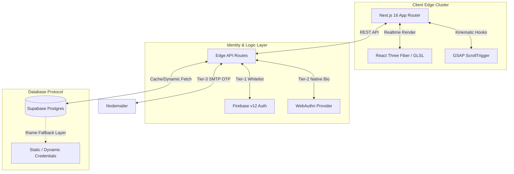

# ✦ NEXUS PORTFOLIO ✦

> An elite, high-performance web portfolio built on **Next.js 16 (App Router)** and **React 19**, designed to showcase 3D kinematics, server-side dynamic credential verification, and a fortified 3-Factor Multi-Authentication Admin Dashboard.


## 🏗️ System Architecture

This portfolio transcends a simple static site. It is a full-stack, edge-optimized platform utilizing serverless hardware constraints.



## ⚡ Core Features

- **Kinematic & 3D Hero Render:** Seamless `Lenis` smooth-scroll architecture backed by dynamic ambient point lights and parallaxing elements.
- **Dynamic Credentials Vault:** Automatically generates functional previews of PDF credentials retrieved directly via the Supabase cache layer, featuring completely responsive client-side pagination (8 on mobile, 16 on desktop).
- **Tier-3 Authentication Dashboard:** 
  1. **Google Auth Identity Whitelist** via Firebase.
  2. **Native Hardware Passkeys** strictly invoked by the `navigator.credentials` standard protocol.
  3. **One-Time Emailed Cipher** generated natively by NodeMailer running on edge processes.
- **Database Driven Operations:** Live dynamic projects pulled instantly from the backend, modifiable seamlessly directly through the authenticated admin portal.

## 🚀 Local Deployment

Ensure Node.js 20+ is installed on your system.

```bash
git clone https://github.com/RajTewari01/portfolio_main.git
cd portfolio_main

# Install dependencies strictly
npm ci

# Initialize local server
npm run dev
```

Navigate to `http://localhost:3000`.

## ⚙️ CI/CD Pipelines

This repository is governed by strictly automated enterprise CI/CD verification workflows:
- `.github/workflows/lint.yml`: Automatically tests TypeScript schemas and ESLint formatting on pull requests.
- `.github/workflows/build.yml`: Hard-compiles the Next.js cache and App Router to prevent breaking production changes.

## 📜 License

This software is released globally under the **MIT License**.

Copyright (c) 2026 Biswadeep Tewari

Permission is hereby granted, free of charge, to any person obtaining a copy of this software and associated documentation files (the "Software"), to deal in the Software without restriction, including without limitation the rights to use, copy, modify, merge, publish, distribute, sublicense, and/or sell copies...
(See the full `LICENSE` file for more details).
