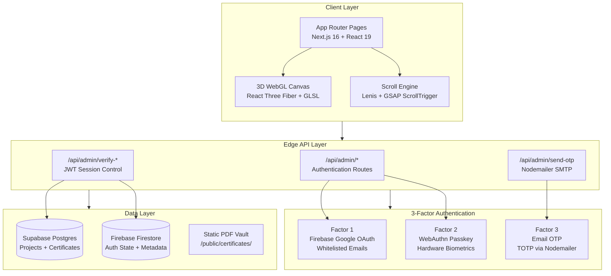
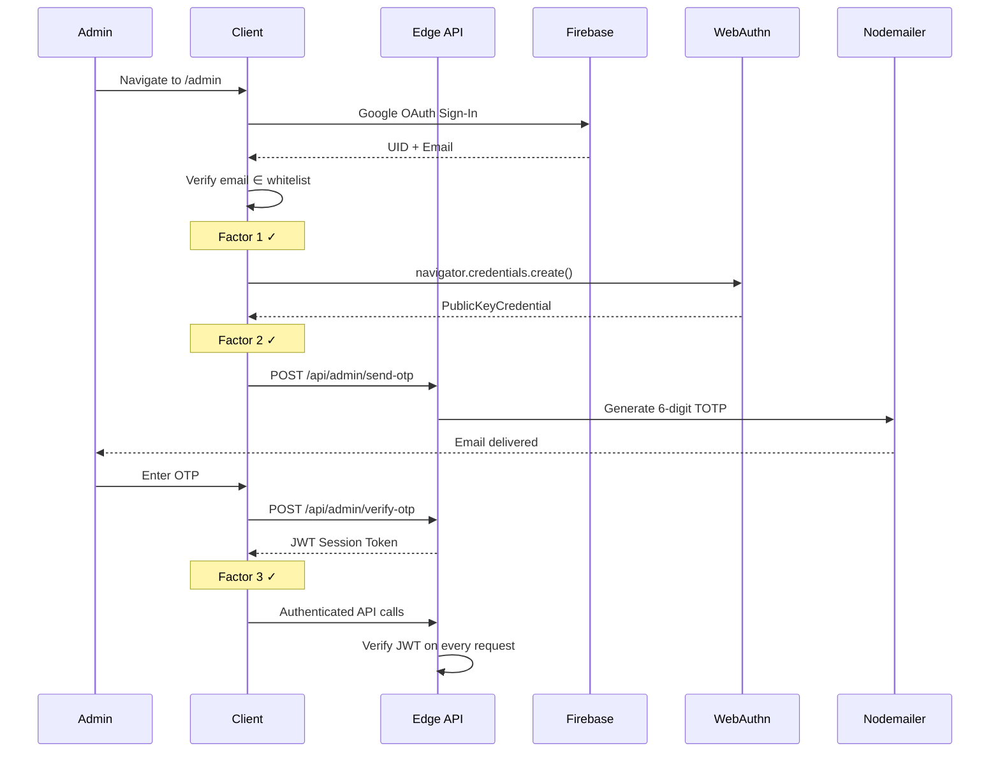
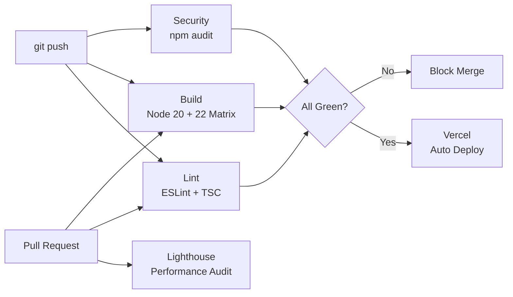

# NEXUS — Enterprise Portfolio Platform

> **A high-performance, full-stack portfolio engineered on Next.js 16 (App Router), React 19, and Three.js — featuring 3D WebGL rendering, cinematic scroll animations, a fortified 3-Factor Authentication admin vault, and edge-deployed serverless APIs.**

[](https://github.com/RajTewari01/portfolio_main/actions/workflows/build.yml)
[](https://github.com/RajTewari01/portfolio_main/actions/workflows/lint.yml)
[](https://github.com/RajTewari01/portfolio_main/actions/workflows/security.yml)
[](LICENSE)

**Live** → [biswadeeptewari.vercel.app](https://biswadeeptewari.vercel.app)

---

## Why Nexus?

Most portfolios are static HTML templates. **Nexus** is an architected platform — a showcase of real engineering depth, not just design polish. Every animation is physics-driven, every API route is edge-optimized, and the admin dashboard is protected by hardware-level biometrics.

---

## System Architecture



---

## Core Modules

### Cinematic Frontend

| Feature | Implementation |
|---|---|
| **3D Background** | React Three Fiber + custom GLSL vertex/fragment shaders with ambient point lights |
| **Parallax Hero** | Perspective-driven sticky scroll with dynamic scale, blur, and rotation transforms |
| **SVG Mask Reveal** | `clip-path: circle()` with eased scroll-driven expansion using `getBoundingClientRect()` |
| **Infinite Marquee** | CSS `@keyframes` with `IntersectionObserver` trigger — zero JS scroll dependencies |
| **Smooth Scroll** | Lenis scroll engine with custom easing: `1.001 - 2^(-10t)` |

### Credential Vault

| Feature | Implementation |
|---|---|
| **PDF Previews** | Native `<iframe>` on desktop, Google Docs Viewer proxy on mobile |
| **Responsive Grid** | 8 cards on mobile (`< 768px`), 16 on desktop, with "View All" pagination |
| **Dynamic Fetch** | Supabase Postgres with realtime subscription fallback to static `/public/certificates/` |

### 3-Factor Admin Authentication



---

## Tech Stack

| Layer | Technologies |
|---|---|
| **Framework** | Next.js 16 (App Router), React 19, TypeScript 5 |
| **3D / Animation** | React Three Fiber, Three.js, GSAP, Lenis, Framer Motion |
| **Styling** | Tailwind CSS 4, CSS Variables, Custom Design Tokens |
| **Authentication** | Firebase Auth v12, WebAuthn/FIDO2, Nodemailer |
| **Database** | Supabase (Postgres), Firebase Firestore |
| **Deployment** | Vercel Edge Functions, GitHub Actions CI/CD |
| **Security** | JWT Sessions, TOTP, Hardware Biometrics, Email Whitelist |

---

## Quick Start

```bash
# Clone
git clone https://github.com/RajTewari01/portfolio_main.git
cd portfolio_main

# Install
npm ci

# Configure environment
cp .env.local.example .env.local
# Edit .env.local with your credentials

# Initialize database
# Run setup_supabase.sql in Supabase SQL Editor

# Launch
npm run dev
```

Open [http://localhost:3000](http://localhost:3000).

---

## Environment Variables

| Variable | Required | Description |
|---|---|---|
| `NEXT_PUBLIC_SUPABASE_URL` | ✅ | Supabase project URL |
| `NEXT_PUBLIC_SUPABASE_ANON_KEY` | ✅ | Supabase anonymous key |
| `NEXT_PUBLIC_FIREBASE_API_KEY` | ✅ | Firebase Web API key |
| `NEXT_PUBLIC_FIREBASE_AUTH_DOMAIN` | ✅ | Firebase auth domain |
| `NEXT_PUBLIC_FIREBASE_PROJECT_ID` | ✅ | Firebase project ID |
| `EMAIL_USER` | ✅ | Gmail address for OTP delivery |
| `EMAIL_PASS` | ✅ | Gmail App Password (not account password) |
| `JWT_SECRET` | ✅ | Secret key for JWT session signing |
| `ADMIN_PIN` | ✅ | 6-digit admin verification PIN |

---

## CI/CD Pipeline



| Workflow | Trigger | What It Does |
|---|---|---|
| `lint.yml` | Push + PR | ESLint analysis + TypeScript strict validation |
| `build.yml` | Push + PR | Production build across Node 20 & 22 matrix |
| `security.yml` | Push + PR + Weekly | NPM dependency audit + license compliance |
| `lighthouse.yml` | PR only | Lighthouse performance scoring with artifact upload |

---

## Project Structure

```
├── .github/workflows/     # CI/CD pipeline definitions
├── public/
│   ├── certificates/      # Static PDF credential vault
│   └── profile.jpg        # Hero section avatar
├── scripts/
│   └── ingest_vault.js    # Supabase certificate ingestion
├── src/
│   ├── app/
│   │   ├── admin/         # 3FA admin dashboard
│   │   ├── api/admin/     # Edge API routes
│   │   ├── hire/          # Contact & hiring page
│   │   └── page.tsx       # Root composition
│   ├── components/
│   │   ├── ParallaxHero   # 3D sticky scroll hero
│   │   ├── AboutSection   # SVG mask reveal + skills
│   │   ├── ProjectsSection # Dynamic project grid
│   │   ├── CertificatesSection # PDF vault + pagination
│   │   ├── SkillsMarquee  # Infinite CSS marquee
│   │   ├── ThreeCanvas    # WebGL background
│   │   └── ContactSection # Form + social links
│   └── lib/
│       ├── supabase.ts    # Database client
│       └── firebase.ts    # Auth client
├── setup_supabase.sql     # Database schema
├── vercel.json            # Deployment routing
└── LICENSE                # MIT
```

---

## License

MIT © 2026 **Biswadeep Tewari**

See [LICENSE](LICENSE) for full terms.
